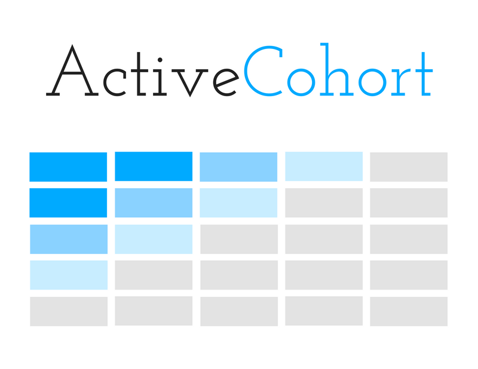

# ActiveCohort

Cohort reports for ActiveRecord.



## Project State

This project is in early *beta* pending the completion of issues in [milestone 1.0.0](https://github.com/joshsaintjacque/ActiveCohort/issues?q=is%3Aopen+is%3Aissue+milestone%3A1.0.0). The API is subject to change until that milestone is reached.

## Installation

ActiveCohort is built to work in a Rails application.

```sh
gem install ActiveCohort
```
Or, in your gemfile

```ruby
gem 'ActiveCohort'
```

And then run 

```sh
bundle install
```

## Example

```ruby
# Instantiate a new ActiveCohort instance
cohort = ActiveCohort.new(some_users, activation_criteria, interval: 'week')

# Let it fly!
cohort.generate_report
# => [["", "Week 0", "Week 1", "Week 2", "Week 3", "Week 4", "Week 5"],
#     ["1/2", "43.0%", "22.1%", "2.7%", "0.5%", "0.0%", "0.0%"],
#     ["1/9", "39.9%", "18.6%", "7.6%", "0.0%", "0.0%"],
#     ["1/16", "42.2%", "3.1%", "0.0%", "0.0%"],
#     ["1/23", "31.8%", "17.0%", "2.3%"],
#     ["1/30", "35.7%", "19.3%"]]

```

## Usage

In order to create a cohort report you need a collection of records you want to report on (e.g., users, orders, etc.) and a lambda that will be used to iterate over the collection to determine the activation rate for each period of time. Don't worry, the second part is less complex than it sounds.

Create an `ActiveRecord::Relation` collection of records that will serve as the basis of your cohorts.

For instance, if you're tracking user who make a purchase after creating an account this would be a collection of the users you want to include.

```ruby
users = User.where('created_at > ?', 30.days.ago)
```

ActiveCohort will iterate over this collection for each interval of time on the report (days, weeks, etc.) and needs a way to tell how many of the records have "activated" (the conversion percentage that shows up on the report).

Create a lambda (just a method/code block that we can pass around) that will take a record, start date, and end date and return a boolean indicating whether it's activated. It must accept three inputs in this order, their names don't matter.

```ruby
activation_criteria = lambda do |user, start_at, end_at| 
  user.orders.where(created_at: start_at..end_at).present?
end
```

Now just plug your records and lambda into a new instance:
```ruby
cohort = ActiveCohort.new(users, activation_criteria, interval: 'week')
cohort.generate_report
# => [["", "Week 0", "Week 1", "Week 2", "Week 3", "Week 4", "Week 5"],
#     ["1/2", "43.0%", "22.1%", "2.7%", "0.5%", "0.0%", "0.0%"],
#     ["1/9", "39.9%", "18.6%", "7.6%", "0.0%", "0.0%"],
#     ["1/16", "42.2%", "3.1%", "0.0%", "0.0%"],
#     ["1/23", "31.8%", "17.0%", "2.3%"],
#     ["1/30", "35.7%", "19.3%"]]
```

The report is represented by a matrix.

## Options

In addition to the records and criteria lambda, ActiveCohort also accepts of hash that may contain the following options:

`start_at` - The date at which to begin the analysis. Default: 30 days ago.

`interval` - A String representation of the interval to run the analysis over (e.g, day, week, etc.) For instance, 'week' would result in a week-over-week analysis. Default: 'day'.

`interval_timestamp_field` - A String representation of the timestamp field on the cohort records to be used to offset between intervals. Default: 'created_at'.

## Support

Please [open an issue](https://github.com/joshsaintjacque/activecohort/issues/new) for support.

## Contributing

Please contribute using [Github Flow](https://guides.github.com/introduction/flow/). Create a branch, add commits, and [open a pull request](https://github.com/joshsaintjacque/activecohort/compare/).
